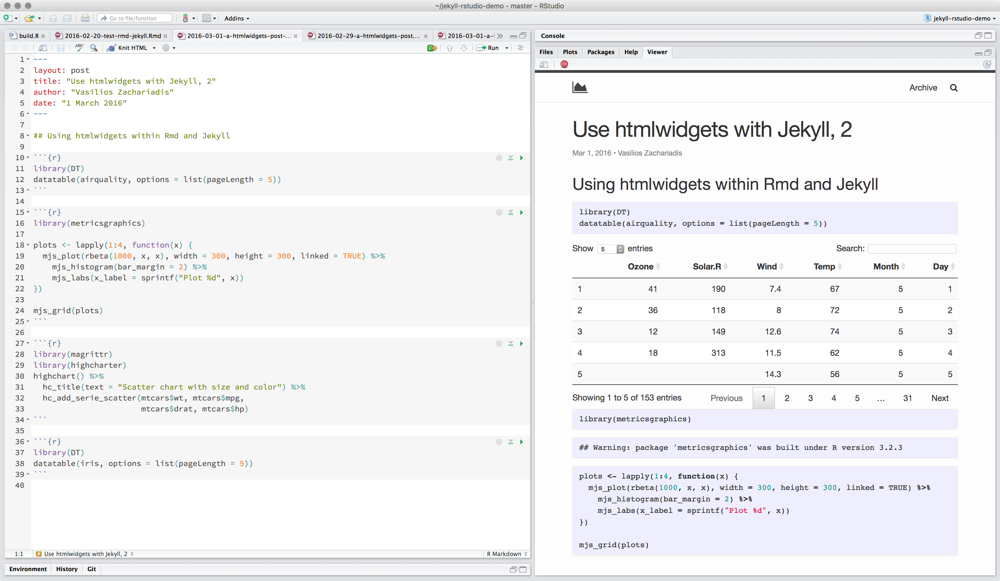
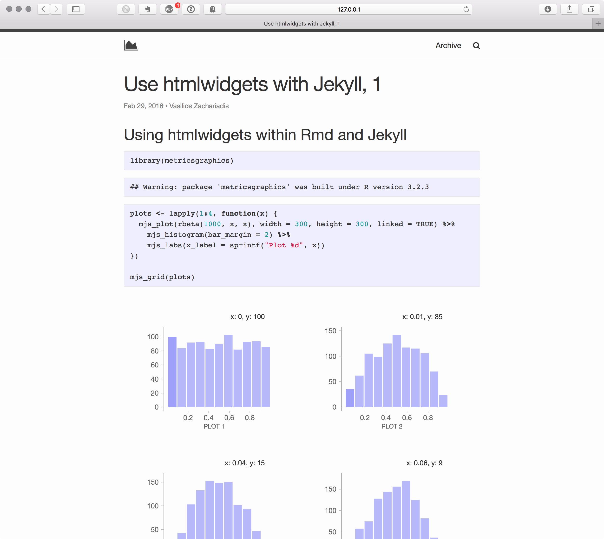

# Jekyll + Rmd + htmlwidgets for sharing/publishing science to the web

Purpose:
* Share interactive Rmarkdown documents with collaborators in a clean interface
* Do it all from within RStudio

How I use it:
* Edit Rmarkdown and preview rendered site in Rstudio using `servr::jekyll()`
* Use Git with a post-receive hook for building and deploying the Jekyll site remotely
* Git push (from whithin RStudio) now becomes deploy

Based on/Credit to:
* [knitr-jekyll by yihui](https://github.com/yihui/knitr-jekyll)
* [htmlwidgets support from brendan-r](https://github.com/brendan-r/knitr-jekyll)
* Full-text search with lunr.js (solution borrowed from [katydecorah](https://github.com/katydecorah/katydecorah.github.io))
* Archive timeline styling borrowed from [katydecorah](https://github.com/katydecorah/katydecorah.github.io)

Requirements:
* [Jekyll 3.x](http://jekyllrb.com)
* [brocks](https://github.com/brendan-r/brocks) (in R, `devtools::install_github("brendan-r/brocks")`)
* [jekyll-scholar](https://github.com/inukshuk/jekyll-scholar)
* [jekyll_file_exists](https://github.com/michaelx/jekyll_file_exists) (included in this repo)

Note: if hosting on Github pages, you will have to build the site locally first since the jekyll plugins are not allowed.

### Screenshots

### License 
[MIT](LICENSE.md)
